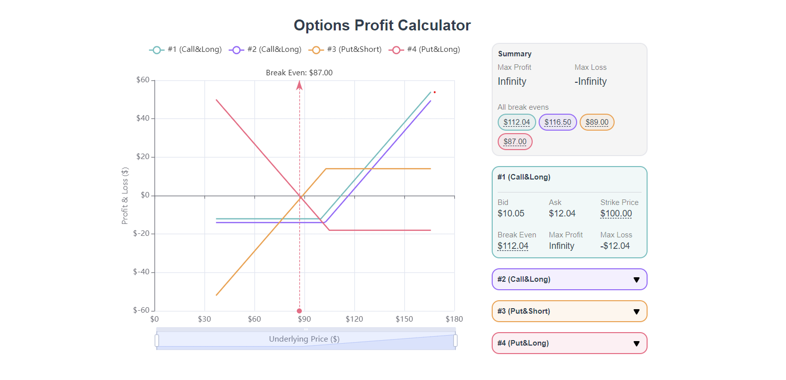

# Options Profit Calculator

## Screenshot

## Features

- 🎛️ Interactive Chart with Pan & Zoom: Use your mouse wheel to easily navigate and explore data.
- 📊 Tooltips for Profit or Loss Information: Hover over points on the chart to instantly see profit or loss details.
- 🖱️ Clickable Detail Sections: Clickable actions to indicate break-even and strike price points for a more intuitive experience.
- 📂 Accordion for Detailed Information: Expandable accordion sections to view all relevant information neatly organized.
- 💻 Accessible Navigation: Elements are navigable and actionable via keyboard.
- 🧏 Structured Headers: Headers are structured according to a11y standards for screen reader navigation.

## Tech Stack

- 🔷 Vue 2
- 🎨 Tailwind CSS
- 📈 Apache ECharts
- 🔡 TypeScript
- 🌟 Bun
- 🧪 Vitest
- 🔍 React Testing Library
- 🔧 Lodash

## Acknowledgments

- 100% code coverage on the source code 🥳
- Improved DevX with Typescript 🤓

---

## Objective

Design and implement a front-end for options strategy risk and reward analysis using Vue.

## Brief

Your challenge is to create a Vue component that can generate a risk & reward graph for options strategies. The component should accept an input of up to four options contracts and output the following:

1. A risk & reward graph where X is the price of the underlying at the time of expiry and Y is the profit/loss at that price.
2. Max profit, max loss, and all break even points.

### Evaluation Criteria

- Completeness of the logic
- Usability of the graph
- Aesthetics of the UI
- Readability and code structure

### CodeSubmit

Please organize, design, test, and document your code as if it were
going into production - then push your changes to the main branch.

Reply to the invitation e-mail with your github username to notify of completion.

Have fun coding! 🚀
The Aries Financial Team
